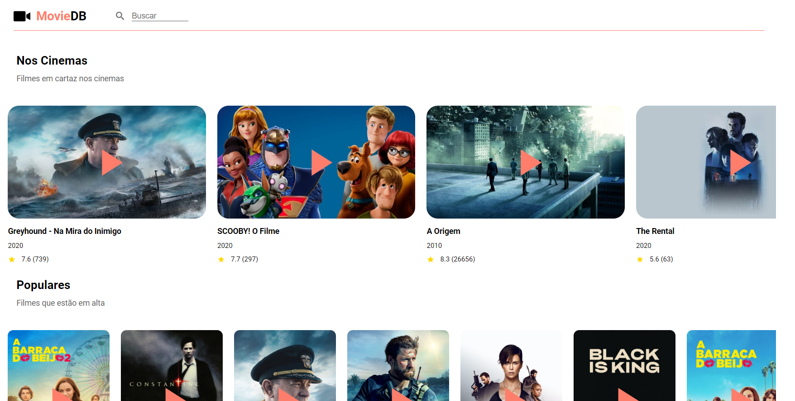

# Índice

- [Sobre](#sobre)
- [Tecnologias Utilizadas](#tecnologias-utilizadas)
- [Como Usar](#como-usar)
- [Como Contribuir](#como-contribuir)

<a id="sobre"></a>

## :bookmark: Sobre

O <strong>MovieDB</strong> é uma aplicação Web que faz uma busca, listagens e detalhamentos de filmes.

Essa aplicação foi construída utilizando a API [TMDB](https://developers.themoviedb.org/3).

<a id="tecnologias-utilizadas"></a>

## :rocket: Tecnologias Utilizadas

O projeto foi desenvolvido utilizando as seguintes tecnologias

- [ReactJS](https://reactjs.org/)
- [TMDBapi](https://developers.themoviedb.org/3)
- [React Router](https://reacttraining.com/react-router/web/guides/quick-start)
- [React Indiana Drag Scroll](https://www.npmjs.com/package/react-indiana-drag-scroll)
- [Axios](https://github.com/axios/axios)

## :heavy_check_mark: Resultado:

<h1 align="center">
    
</h1>

<a id="como-usar"></a>

## :fire: Como usar

- ### **Pré-requisitos**

  - É **preciso** ter um gerenciador de pacotes seja o **[NPM](https://www.npmjs.com/)** ou **[Yarn](https://yarnpkg.com/)**.

1. Faça um clone :

```sh
  $ git clone https://github.com/williamroberttv/moviedb.git
```

2. Executando a Aplicação:

```sh
  # Instale as dependências
  $ npm install

  # Inicie a aplicação
  $ npm start

```

<a id="como-contribuir"></a>

## :recycle: Como contribuir

- Faça um Fork desse repositório,
- Crie uma branch com a sua feature: `git checkout -b my-feature`
- Commit suas mudanças: `git commit -m 'feat: My new feature'`
- Push a sua branch: `git push origin my-feature
